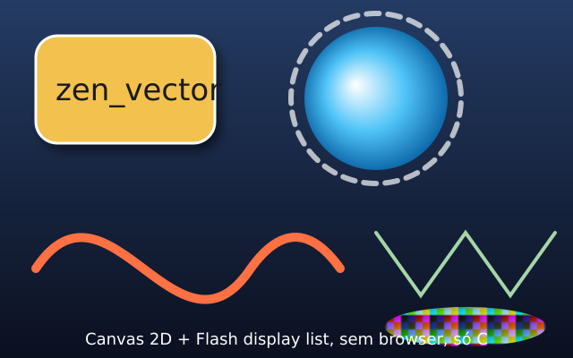

# zen_vector

A 2D vector rasterizer in C11 with a Canvas 2D API and a Flash-style display list. No dependencies beyond libm: it draws into a buffer of 32-bit pixels that you hand to SDL, OpenGL, Direct3D, a window system, or a file.



## What it does

| Header | Contents |
|---|---|
| `zv_pixel.h` | premultiplied RGBA8 pixels, exact source-over blending, spans (SSE2 / NEON), surfaces, conversion from and to straight alpha |
| `zv_geom.h` | 2x3 affine matrices, paths (move, line, quadratic, cubic, close), curve flattening with a guaranteed error bound, bounds |
| `zv_raster.h` | scanline rasterizer with analytic anti-aliasing, nonzero and even-odd fill rules, clipping |
| `zv_paint.h`, `zv_fill.h` | solid colours, linear and two-circle radial gradients (pad / reflect / repeat, optional dithering), bitmap patterns (nearest / bilinear), fills with a paint |
| `zv_stroke.h` | strokes: miter / round / bevel joins with miter limit, butt / round / square caps, dashes |
| `zv_canvas.h` | Canvas 2D: state stack, transforms, paths incl. `arc`, `arcTo`, `ellipse`, `roundRect`, clip, 15 composite operations, `drawImage`, image data, text, shadows, layers |
| `zv_font.h` | TrueType outlines as paths (cmap 4 and 12, composite glyphs, kerning), glyph cache |
| `zv_filter.h` | gaussian blur (three box blurs) on surfaces and masks |
| `zv_flash.h` | retained `Graphics` (`beginFill`, `lineStyle`, `curveTo`, `drawRoundRect`, `drawPath`, ...), `Sprite` tree with matrix, alpha, mask, blend modes and `cacheAsBitmap`, `Stage` with dirty rectangles |

## Using it

Copy `include/` and `src/` into your project and compile the `src/*.c` files, or add the directory with CMake (`add_subdirectory(zen_vector)` and link `zen_vector`; set `ZV_BUILD_TOOLS=OFF` to skip the tools and tests).

```c
#include "zv_canvas.h"

ZvSurface surface;
zv_surface_init(&surface, NULL, 640, 400);   /* NULL: malloc/free; or your own ZvAllocator */
ZvCanvas c;
zv_canvas_init(&c, &surface, NULL);

zv_canvas_set_fill_color(&c, 0xFF3366CC);     /* straight 0xAARRGGBB */
zv_canvas_begin_path(&c);
zv_canvas_arc(&c, 320, 200, 100, 0, 6.2831853f, false);
zv_canvas_fill(&c, ZV_FILL_NONZERO);
zv_canvas_set_stroke_color(&c, 0xFFFFFFFF);
zv_canvas_set_line_width(&c, 4);
zv_canvas_stroke(&c);
```

`surface.pixels` is `0xAARRGGBB` per `uint32_t` with premultiplied alpha (B, G, R, A in memory on little endian). That is `SDL_PIXELFORMAT_ARGB8888`, and `GL_BGRA` / `GL_UNSIGNED_BYTE` for `glTexImage2D`. An opaque surface needs no conversion. When the surface has transparency, blend it as premultiplied (`GL_ONE, GL_ONE_MINUS_SRC_ALPHA`) or convert with `zv_surface_store_pixels` to straight alpha. `examples/sdl2_canvas.c` is a complete SDL2 program.

Flash style:

```c
ZvStage stage;
zv_stage_init(&stage, &surface, NULL);
ZvSprite ball;
zv_sprite_init(&ball, NULL);
zv_graphics_begin_fill(&ball.graphics, 0xFF4040, 1.0f);
zv_graphics_draw_circle(&ball.graphics, 0, 0, 30);
zv_graphics_end_fill(&ball.graphics);
zv_sprite_add_child(&stage.root, &ball);
zv_sprite_set_position(&ball, 100, 100);
zv_stage_render(&stage);                       /* redraws only what changed */
```

## How it is verified

- Unit tests with independent references: the exact area of a polygon inside each pixel (the rasterizer is within 2/255 of it), straight interpolation for gradients, the distance formula for radial gradients, matrices with their inverses, curve flattening sampled densely against the polyline.
- 32 scenes rendered by Chromium's canvas (`tools/ref_render.js`, Playwright) and compared pixel by pixel (`tools/vcmp`). The measured differences and the tolerances derived from them are in `docs/` (Portuguese).
- Every test also runs under AddressSanitizer and UndefinedBehaviorSanitizer; CI builds on Linux, Windows (MSVC) and macOS (arm64, the NEON path).

Build and test:

```sh
cmake -S . -B build -DCMAKE_BUILD_TYPE=Release
cmake --build build
ctest --test-dir build --output-on-failure
build/bench_raster        # 1280x720 scenes, ms
build/bench_pixel         # ns per pixel of the blend paths
```

The test font is DejaVu Sans (`fonts/LICENSE`).
